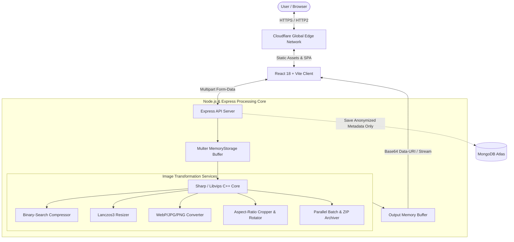

# 📖 Project Documentation: Image In Kb

> **Production-Grade, In-Memory Image Optimization & SaaS Platform**  
> **Live Website**: [https://imageinkb.com](https://imageinkb.com) | [https://www.imageinkb.com](https://www.imageinkb.com)  
> **GitHub Repository**: [https://github.com/prathamshahi1/Image-In-Kb](https://github.com/prathamshahi1/Image-In-Kb)

---

## 1. Executive Summary & Objective

### 1.1 Objective
**Image In Kb** is a high-performance web platform designed to solve one of the most persistent bottlenecks on the internet: **accurate, fast, and privacy-first image compression and resizing**. 

Whether students and job seekers need to compress documents strictly under **20 KB** or **50 KB** for official government portals (UPSC, SSC, Visa applications), or developers need to optimize modern WebP assets to improve Google Core Web Vitals (Largest Contentful Paint), Image In Kb delivers instant, in-memory image transformation without data retention or image degradation.

### 1.2 The Core Problem vs. Our Solution
| Traditional Online Compressors | Image In Kb Solution |
| :--- | :--- |
| ❌ Arbitrary quality slider (results in blurred text or oversized files) | ✅ **Iterative Binary-Search Quality Tuning** ($\le 8$ iterations in RAM) |
| ❌ Writes user photos to server disks or third-party buckets | ✅ **100% In-Memory Volatile Processing** (Zero disk storage) |
| ❌ Cluttered with intrusive ads and watermarks | ✅ **Clean, minimalist UI** with instant downloads & zero watermarks |
| ❌ Single-file upload limit or slow sequential batching | ✅ **Concurrent Batch Engine** with streaming ZIP packaging |

---

## 2. Technical Stack & Tools

```text
┌────────────────────────────────────────────────────────────────────────┐
│                          IMAGE IN KB TECH STACK                        │
├────────────────────────────────────────────────────────────────────────┤
│  Frontend           : React 18, Vite 5, Tailwind CSS, Lucide React     │
│  State & Context    : ThemeContext (Light/Dark), AuthContext (JWT)     │
│  Backend Runtime    : Node.js (ES Modules), Express.js                 │
│  Image Engine       : Sharp (C++ Libvips Native Multi-Threaded Engine) │
│  Database           : MongoDB Atlas (Mongoose ODM)                     │
│  Archive Generator  : Archiver (Streaming In-Memory ZIP)               │
│  Security & Headers : Helmet, CORS, Express Rate Limit, BcryptJS       │
│  Edge Deployment    : Cloudflare Workers & Static Assets               │
│  SEO & Analytics    : JSON-LD Schemas, GA4 (G-XZXTB4EGCN), GSC         │
└────────────────────────────────────────────────────────────────────────┘
```

### Detailed Component Overview:
- **Frontend Engine**: React 18 SPA powered by Vite for instant Hot Module Replacement (HMR) and sub-second production builds.
- **Styling Architecture**: Tailored CSS with Tailwind, dual-theme support (default Light mode + Dark mode), glassmorphism cards, and responsive mobile drawers.
- **Image Core**: Native C++ Libvips integration via Sharp, executing Lanczos3 anti-aliasing interpolation and multi-core parallel compression.
- **Cloudflare Edge**: Serverless deployment routing through Cloudflare global edge network (`wrangler.toml` + `worker.js`) with edge caching and SSL.

---

## 3. System Architecture & In-Memory Pipeline



### Zero-Retention Architecture
When an image is uploaded:
1. `multer.memoryStorage()` parses the incoming HTTP stream directly into a volatile `Buffer` in Node.js RAM.
2. The buffer is processed by Sharp using native C++ threads.
3. The resulting optimized buffer is encoded and streamed directly back to the client.
4. Node.js garbage collection immediately reclaims the RAM. **No raw images ever touch permanent disk storage.**

---

## 4. Key Features & Algorithms

### 4.1 Precision Target-KB Compression Algorithm
Instead of crude single-pass degradation, Image In Kb employs an **Iterative Binary-Search Quality Tuning Algorithm**:

$$\text{Target Quality Range: } [Q_{\min} = 1, Q_{\max} = 100]$$

```text
Initialize: low = 1, high = 100, bestBuffer = null, iterations = 0
While low <= high and iterations < 8:
    mid = floor((low + high) / 2)
    output = sharp(input).jpeg({ quality: mid }).toBuffer()
    
    If size(output) <= targetSizeBytes:
        bestBuffer = output
        low = mid + 1      // Try higher quality
    Else:
        high = mid - 1     // File too large, reduce quality
        
Return bestBuffer
```
This guarantees the **maximum possible visual fidelity** while strictly staying within the specified byte quota (e.g. 50 KB, 100 KB, 200 KB).

### 4.2 Smart Image Resizer (`/resize`)
- **Pixel Dimension Scaling**: Exact width and height resizing with aspect-ratio preservation.
- **Percentage Scaling**: Scaled down by 25%, 50%, 75%, or custom percentage factors.
- **Lanczos3 Interpolation**: High-quality 3-lobed Lanczos kernel prevents pixelation and jagged edges.

### 4.3 Format Converter (`/convert`)
- Bidirectional conversion between **WebP**, **JPG**, and **PNG**.
- Palette reduction and chroma subsampling optimization for Google PageSpeed / Core Web Vitals.

### 4.4 Interactive Crop & Rotate Editor (`/editor`)
- Live HTML5 canvas crop rectangle with pre-configured aspect ratios:
  - **1:1** (Square profile pictures)
  - **4:3** (Standard photos)
  - **16:9** (Cinema / YouTube thumbnails)
  - **3:2** (DSLR photography)
- 90° Clockwise Rotation, Horizontal Flip, and Vertical Flip.

### 4.5 Government Exam & Form Suite
- **Passport Photo Resizer** (`/passport-photo`):
  - Pre-calibrated international templates: US Passport ($2 \times 2\text{ in} / 600 \times 600\text{ px}$), Schengen & India Visa ($35 \times 45\text{ mm} / 413 \times 531\text{ px}$), SSC/UPSC ($200 \times 230\text{ px}$).
  - Automatic 50 KB / 100 KB size caps.
- **Signature Compressor** (`/signature-compressor`):
  - High-contrast background whitening and strict $< 10\text{ KB}$, $< 20\text{ KB}$, $< 50\text{ KB}$ limits for official portals.

### 4.6 Batch Multi-Image Processing (`/batch`)
- Process up to 20 images in parallel.
- Real-time aggregation of total bytes saved.
- In-memory streaming ZIP archive generation using `archiver`.

---

## 5. SEO & Google Indexing Architecture

To achieve top rankings on Google for high-volume keywords, the platform includes a complete SEO engine:

1. **Structured Data JSON-LD Schemas**:
   - `SoftwareApplication` schema on the homepage.
   - `FAQPage` schema on the FAQ section.
2. **Dynamic Meta & Canonical Tags**: Managed via `SeoHead.jsx` for all 17 public routes.
3. **600+ Word Educational & Technical Guide**: In-depth coverage of binary search tuning, WebP vs. JPG vs. PNG comparison tables, and portal upload guidelines.
4. **8-Question Expandable Accordion FAQ**: Addressing user privacy, compression limits, and formats.
5. **Crawler Directives**: Complete [robots.txt](file:///Users/pshahi/Documents/img%20resizer/client/public/robots.txt) and [sitemap.xml](file:///Users/pshahi/Documents/img%20resizer/client/public/sitemap.xml).
6. **Google Analytics 4**: Integrated measurement tag `G-XZXTB4EGCN`.
7. **Google Search Console**: Verified and submitted sitemap.

---

## 6. REST API Reference

| Method | Endpoint | Description | Auth Required |
| :--- | :--- | :--- | :--- |
| `GET` | `/api/health` | Service health status & uptime | No |
| `POST` | `/api/auth/register` | Create account (`{ name, email, password }`) | No |
| `POST` | `/api/auth/login` | Authenticate user & issue JWT | No |
| `GET` | `/api/auth/me` | Fetch authenticated user profile | Yes (JWT) |
| `POST` | `/api/images/inspect` | Inspect dimensions, format, and size | No |
| `POST` | `/api/images/compress` | Compress to target KB or range | No |
| `POST` | `/api/images/resize` | Resize by pixels or percentage | No |
| `POST` | `/api/images/convert` | Convert format to WebP, JPG, or PNG | No |
| `POST` | `/api/images/edit` | Crop, rotate, and flip | No |
| `POST` | `/api/images/process-batch` | Concurrent multi-image batch to ZIP | No |
| `GET` | `/api/history` | Retrieve user optimization history | Yes (JWT) |
| `GET` | `/api/history/stats` | Aggregated user savings analytics | Yes (JWT) |
| `DELETE`| `/api/history/:id` | Delete history record | Yes (JWT) |

---

## 7. Directory Structure

```text
Image-In-Kb/
├── client/                           # Frontend React SPA
│   ├── public/
│   │   ├── logo.svg                  # Brand vector icon
│   │   ├── robots.txt                # Search crawler instructions
│   │   └── sitemap.xml               # 17-route XML sitemap
│   ├── src/
│   │   ├── components/               # Navbar, Footer, SeoHead, FaqSection, etc.
│   │   ├── context/                  # ThemeContext, AuthContext
│   │   ├── pages/                    # 17 pages (Home, Tools, Legal, 404, etc.)
│   │   ├── services/                 # Axios HTTP client
│   │   └── utils/                    # Byte and dimension formatters
│   ├── index.html                    # Root HTML with Google Analytics
│   ├── package.json
│   ├── vite.config.js
│   └── wrangler.toml                 # Cloudflare Pages build config
│
├── server/                           # Backend Node.js / Express API
│   ├── src/
│   │   ├── config/                   # db.js (MongoDB), constants.js
│   │   ├── controllers/              # authController, imageController, historyController
│   │   ├── middleware/               # auth, multer, rateLimiter, error
│   │   ├── models/                   # User.js, History.js
│   │   ├── routes/                   # authRoutes, imageRoutes, historyRoutes
│   │   ├── services/                 # compressionService, resizeService, etc.
│   │   └── server.js                 # Express server entry point
│   ├── render.yaml                   # Render deployment configuration
│   └── package.json
│
├── worker.js                         # Cloudflare Worker SPA edge router
├── wrangler.toml                     # Root Cloudflare Worker configuration
├── PROJECT_DOCUMENTATION.md          # Comprehensive technical document
└── README.md                         # Project overview & quick start
```

---

## 8. Summary of Accomplishments

1. **End-to-End Image Pipeline**: Built 6 core optimization tools running at C++ native speeds with in-memory zero-storage architecture.
2. **Modern UX & Design**: Responsive mobile drawers, Light/Dark theme switching, real-time comparison sliders, and instant download triggers.
3. **SEO & Legal Compliance**: Complete SEO suite (JSON-LD schemas, technical guides, FAQ, sitemap, robots.txt) and legal suite (Privacy Policy, Terms of Service, About Us, Contact Us, 404 page).
4. **Global Edge Deployment**: Live on Cloudflare edge network at **[https://imageinkb.com](https://imageinkb.com)** with Google Analytics and Google Search Console indexing.
